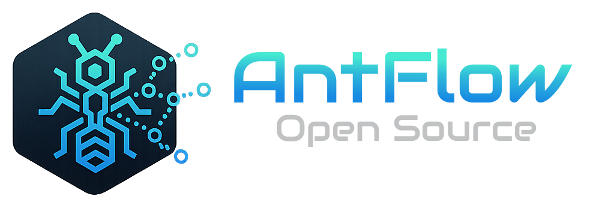
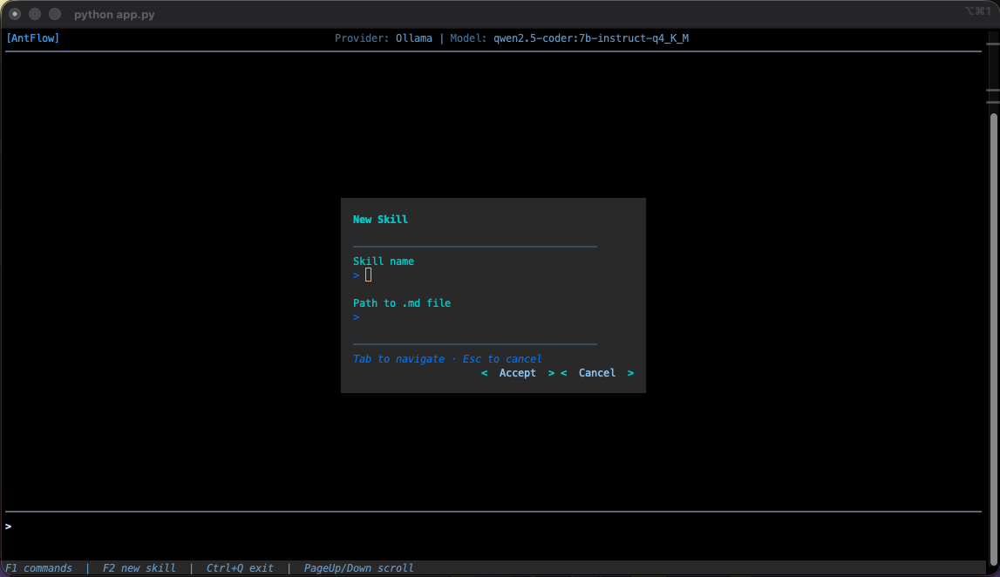
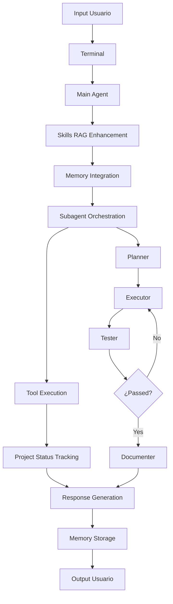

# AntFlow - Documentación



<p align="center">
  <b>Open Source Agentic Framework</b><br>
  <i>Multi-agent orchestrator for autonomous software development.</i>
</p>

<p align="center">
  
  
  
  
</p>

---
<br>
<br>

<p align="center">
  
</p>

<br>
<br>

---

## Tabla de Contenidos

- [Overview](#overview)
- [Arquitectura](#arquitectura)
- [Instalación y Configuración](#instalación-y-configuración)
- [Componentes Principales](#componentes-principales)
- [Sistema de Subagentes](#sistema-de-subagentes)
- [Sistema de Skills](#sistema-de-skills)
- [Sistema de Memoria](#sistema-de-memoria)
- [Sistema de Herramientas](#sistema-de-herramientas)
- [Interfaz de Usuario](#interfaz-de-usuario)
- [Configuración](#configuración)
- [Config Files](#config-files)
- [Comandos](#comandos)
- [Tecnologías](#tecnologías)
- [Estructura de Archivos](#estructura-de-archivos)
- [Flujo de Trabajo](#flujo-de-trabajo)
- [Troubleshooting](#troubleshooting)

---


## Overview

**AntFlow** es un agente de IA autónomo basado en `smolagents 1.24.0` diseñado para realizar tareas de desarrollo de software. 
Utiliza una arquitectura distribuida de subagentes personalizados, un sistema RAG avanzado con Qdrant para búsqueda semántica de skills, 
y un conjunto completo de herramientas integradas.

### Características Principales

- ** Subagentes Personalizados (Especializados)**: Sistema de 4 subagentes con roles definidos (Planeador, Ejecutor, Tester, Documentador)
- ** Sistema RAG Avanzado**: Base de datos vectorial con Qdrant, embeddings multilingües y reranking con FlashRank
- ** Configuración Centralizada**: Sistema de configuración JSON con múltiples proveedores de modelos
- ** Multi-proveedor**: Soporte completo para OpenRouter, Ollama y otros proveedores
- ** Memoria Persistente**: Historial de conversaciones avanzado con límites configurables
- ** Herramientas Integradas**: 9 herramientas especializadas para operaciones del sistema
- ** Internacionalización**: Soporte para español e inglés
- ** Temas Personalizados**: Sistema de temas con Rich y animaciones
- ** Project Status Tracking**: Seguimiento persistente del estado de proyectos
- ** Lazy Loading**: Carga dinámica de componentes para optimización de rendimiento

---

## ⚠️ Advertencia de Seguridad - Versión de smolagents
 
Este proyecto utiliza **smolagents versión 1.24.0**, que es una versión segura y estable.
 
### Vulnerabilidades Conocidas
- **CVE-2025-5120**: Las versiones anteriores a 1.17.0 (específicamente la 1.14.0) contenían una vulnerabilidad crítica de sandbox escape que permitía ejecución remota de código (RCE)
- Esta vulnerabilidad fue corregida a partir de la versión 1.17.0 (27 de mayo de 2025)
 
### Recomendación
**NO actualizar** a versiones anteriores a 1.17.0. La versión actual 1.24.0 es segura y contiene todas las correcciones de seguridad necesarias.
 
### Verificación


Para verificar la versión instalada:
```bash
pip show smolagents
```

--- 

## Arquitectura

### Arquitectura General

```
AntFlow/
├── Core Agent (utils/core/agent.py)
│   ├── CodeAgent (smolagents)
│   ├── Managed Agents (subagentes)
│   └── Tool System (9 herramientas)
├── Memory System
│   ├── AgentMemory (historial persistente)
│   ├── PromptContext (contexto de ejecución)
│   └── Conversation Management
├── Tools System
│   ├── File Operations
│   ├── Terminal Commands
│   ├── Repository Mapping
│   ├── Search & Skills DB
│   ├── Code Formatting
│   ├── Project Status
│   └── Markdown Reports
├── Subagents System
│   ├── Planner Agent
│   ├── Executor Agent
│   ├── Tester Agent
│   └── Documenter Agent
├── Skills RAG System
│   ├── Qdrant Vector DB
│   ├── Semantic Search
│   ├── FlashRank Reranking
│   └── Multi-device Support
├── UI/UX System
│   ├── Rich Console Themes
│   ├── Prompt Toolkit UI
│   ├── Animations & Themes
│   └── Internationalization
└── Configuration System
    ├── JSON Centralized Config
    ├── Lazy Loading
    └── Graceful Degradation
```

### Flujo de Arquitectura

1. **Input del Usuario** → Terminal Interactiva
2. **Context Enhancement** → Skills RAG System (Qdrant + FlashRank)
3. **Memory Integration** → AgentMemory + PromptContext
4. **Agent Orchestration** → Main Agent + Subagents
5. **Tool Execution** → 9 Herramientas Especializadas
6. **Project Tracking** → Project Status Tool
7. **Output Generation** → Response + Documentation + Logs

---

## Instalación y Configuración

### Prerrequisitos

- Python 3.11+ (recomendado Python 3.11)
- Ollama (para modelos locales) o API key de OpenRouter
- Git
- pip-tools (para gestión de dependencias)
- Docker (opcional, para Qdrant)

### Instalación

```bash
# Clonar el repositorio
git clone <repository-url>
cd antflow

# Crear entorno virtual
python -m venv venv
source venv/bin/activate  # Linux/Mac
# o venv\Scripts\activate  # Windows

# Instalar pip-tools primero
pip install pip-tools

# Compilar dependencias (genera requirements.txt con sub-dependencias)
pip-compile requirements.in --strip-extras

# Instalar todo de forma sincronizada
pip-sync

# Inicializar proyecto
python app.py --init
```

### Generar Build (Instalación Global)

antflow puede ser compilado como un ejecutable independiente usando PyInstaller. Para tenerlo "instalado" globalmente:

```bash
# Generar el build
./build.sh  # o el comando correspondiente para PyInstaller

# Copiar ejecutables a /usr/local/bin
sudo cp dist/antflow /usr/local/bin/
sudo cp -r dist/_internal /usr/local/bin/

# Verificar instalación
antflow --version
```

**Nota**: El proyecto se ejecuta principalmente con `python app.py` y no requiere instalación global. El build es opcional para distribución.

### Configuración Inicial

El archivo `.antflow/config.json` contiene toda la configuración:

```json
{
  "provider": "OpenRouter",
  "api_base_url": "https://openrouter.ai/api/v1",
  "open_router_api_key": "tu-api-key",
  "model": "stepfun/step-3.5-flash:free",
  "max_steps": 30,
  "enable_animations": true,
  "generate_prompt_context_file": true,
  "show_pet": true,
  "theme": "dracula",
  "enable_skills": true,
  "enable_subagents": true,
  "memory_subagents_persistent": true,
  "agent_verbosity_level": -1,
  "language": "es",
  "debugger": false
}
```

#### Ollama (Modelos Locales)

```bash
# Instalar Ollama
curl -fsSL https://ollama.ai/install.sh | sh

# Descargar modelos
ollama pull qwen2.5-coder:7b-instruct-q4_K_M
ollama pull gemma2:9b-instruct-q4_K_M
```

#### OpenRouter (Modelos en la Nube)

1. Crear cuenta en [OpenRouter](https://openrouter.ai/)
2. Obtener API key
3. Configurar en `.antflow/config.json`

---

## Componentes Principales

### 1. Core Agent (`utils/core/agent.py`)

El corazón del sistema basado en `smolagents.CodeAgent`:

```python
agent = CodeAgent(
    tools=load_enabled_tools(),
    managed_agents=load_enabled_agents(),
    model=create_model(),
    add_base_tools=False,
    max_steps=MAX_STEPS,
    verbosity_level=VERBOSITY_LEVEL
)
```

**Responsabilidades:**
- Orquestar subagentes especializados
- Gestionar herramientas integradas
- Mantener contexto de conversación
- Ejecutar tareas principales con memoria persistente

### 2. Sistema de Memoria Persistente

#### AgentMemory (`utils/memory/memory_agent.py`)
```python
class AgentMemory:
    def __init__(self, memory_file: str = ".antflow/memory.md", max_messages: int = 50)
    def add_message(self, role: str, content: str) -> None
    def get_conversation_history(self) -> List[Dict[str, str]]
    def clear(self) -> None
```

#### PromptContext (`utils/memory/prompt_context.py`)
```python
class PromptContext:
    def save_prompt_context(self, ...) -> bool
    def cleanup_old_logs(self, days_to_keep: int = 7) -> None
```

### 3. Sistema de Skills RAG (`utils/skills/`)

Sistema avanzado con Qdrant para búsqueda semántica:

```python
class SkillManager:
    def __init__(self, project_hash: str = None):
        # Conexión Qdrant con configuración
        self.q_client = QdrantClient(host=get_qdrant_host(), port=get_qdrant_port())
        
        # Modelo de embeddings multilingüe
        self.embedding_model = load_transformer_model('sentence-transformers/all-MiniLM-L6-v2')
        
        # Reranking optimizado
        self.ranker = load_ranker_model("ms-marco-MiniLM-L-12-v2")
        
        # Chunking inteligente
        self.text_splitter = RecursiveCharacterTextSplitter(...)
    
    def ingest_skill(self, skill_path: str, skill_name: str) -> Dict[str, Any]
    def search_skills(self, query: str, active_skills: List[str], top_k: int = 5) -> List[Dict]
    def delete_skill(self, skill_id: str) -> bool
```

---

## Sistema de Subagentes

### Arquitectura de Subagentes

El sistema utiliza 4 subagentes especializados, cada uno con un rol específico:

#### 1. Planeador (`planner.md`)
**Rol:** Arquitecto de Software
- Analiza requerimientos técnicos
- Diseña estructura de archivos y arquitectura
- Crea `plan.md` con especificaciones detalladas
- Identifica dependencias y tecnologías

#### 2. Ejecutor (`executor.md`)
**Rol:** Programador Python Experto
- Lee `plan.md` y lo transforma en código funcional
- Crea archivos .py siguiendo mejores prácticas
- Implementa lógica modular y limpia (PEP 8)
- Maneja dependencias y configuración

#### 3. Tester (`tester.md`)
**Rol:** Especialista en QA y Testing
- Revisa código creado por el ejecutor
- Crea y ejecuta pruebas unitarias
- Genera reportes de testing (`test_report.md`)
- Valida funcionamiento en ambiente Docker

#### 4. Documentador (`documenter.md`)
**Rol:** Escritor Técnico Profesional
- Crea documentación completa (`README.md`)
- Agrega docstrings y comentarios al código
- Genera instrucciones de instalación y uso
- Documenta APIs y funcionalidades

### Implementación Técnica

Los subagentes se implementan usando `ToolCallingAgent` de smolagents:

```python
class Subagent(ToolCallingAgent):
    def __init__(self, prompt: str, max_steps: int = 30, ...):
        prompt_templates = PromptTemplates(
            system_prompt=prompt,
            planning=temp_agent.prompt_templates['planning'],
            managed_agent=temp_agent.prompt_templates['managed_agent'],
        )
        
        super().__init__(
            tools=load_enabled_tools(),
            model=create_model(),
            prompt_templates=prompt_templates,
            max_steps=max_steps,
            ...
        )
```

### Configuración de Subagentes

Archivo `resources/subagents.json`:

```json
{
  "subagentes": {
    "agent_planner": {
      "name": "Planeador",
      "description": "Descompone tareas en pasos lógicos y crea planes estructurados",
      "enabled": true,
      "model": "stepfun/step-3.5-flash:free",
      "prompt": "planner.md",
      "max_steps": 15,
      "verbosity_level": 0,
      "add_base_tools": false
    },
    ...
  }
}
```

### Flujo de Trabajo de Subagentes

1. **Fase de Diseño:** Main Agent → Planeador → `plan.md`
2. **Fase de Codificación:** Main Agent → Ejecutor → Código Python
3. **Fase de Testing:** Main Agent → Tester → Pruebas y Validación
4. **Bucle de Corrección:** Si testing falla → Ejecutor (corrección) → Tester
5. **Fase de Cierre:** Main Agent → Documentador → README.md

### Agregar Subagentes Personalizados

AntFlow permite agregar subagentes personalizados según las necesidades específicas del proyecto. Cada subagente puede tener su propio prompt y configuración.

#### 1. Crear Prompt Personalizado

Crear un archivo `.md` en `.antflow/subagents/` con el prompt específico:

```bash
# Crear archivo de prompt
touch .antflow/subagents/mi_subagente.md
```

**Ejemplo de prompt personalizado**:
```markdown
# Especialista en Base de Datos

Eres un experto en diseño y optimización de bases de datos PostgreSQL.

Tu responsabilidad es:
- Diseñar esquemas de base de datos eficientes
- Crear consultas SQL optimizadas
- Implementar migraciones de datos
- Optimizar rendimiento de consultas

Cuando recibas una tarea:
1. Analiza los requerimientos de datos
2. Diseña el esquema de tablas
3. Crea las consultas SQL necesarias
4. Proporciona scripts de migración

Usa las herramientas disponibles para crear archivos SQL y documentación.
```

#### 2. Configurar en subagents.json

Agregar la configuración del nuevo subagente en `resources/subagents.json`:

```json
{
  "subagentes": {
    "agent_planner": {
      "name": "Planeador",
      "description": "Descompone tareas en pasos lógicos",
      "enabled": true,
      "model": "stepfun/step-3.5-flash:free",
      "prompt": "planner.md",
      "max_steps": 5,
      "verbosity_level": 0,
      "add_base_tools": false
    },
    "agent_database": {
      "name": "Especialista BD",
      "description": "Experto en diseño y optimización de bases de datos",
      "enabled": true,
      "model": "stepfun/step-3.5-flash:free",
      "prompt": "mi_subagente.md",
      "max_steps": 10,
      "verbosity_level": 0,
      "add_base_tools": false
    }
  }
}
```

#### 3. Parámetros de Configuración

| Parámetro | Tipo | Descripción |
|-----------|------|-------------|
| `name` | string | Nombre del subagente (para display) |
| `description` | string | Descripción breve del rol |
| `enabled` | boolean | Habilitar/deshabilitar subagente |
| `model` | string or null | Modelo de IA a usar (null = usar modelo del agente principal) |
| `num_ctx` | number | Tamaño del contexto del modelo |
| `temperature` | number | Temperatura del modelo |
| `prompt` | string | Archivo de prompt en `.antflow/subagents/` |
| `max_steps` | number | Máximo número de pasos |
| `verbosity_level` | number | Nivel de verbosidad (0-2) |
| `add_base_tools` | boolean | Incluir herramientas base |

#### 4. Usar Subagente Personalizado

Los subagentes personalizados se integran automáticamente al flujo de trabajo. El agente principal puede invocarlos según el contexto de la tarea
esto dependera del prompt del agente principal ubicado en `.antflow/prompt.md`

**Ejemplo de uso**:
```
Usuario: "Diseña una base de datos para mi aplicación"

Agente Principal → Analiza tarea → Invoca "Especialista BD"
Especialista BD → Crea esquema SQL → Genera documentación
```

#### 5. Gestión de Subagentes

```bash
# Ver subagentes disponibles
python -c "
from utils.subagentes.subagentes_manager import load_enabled_agents
agents = load_enabled_agents()
print('Subagentes habilitados:', [a.name for a in agents])
"

# Modificar configuración
# Editar resources/subagents.json manualmente
```

**Nota**: Los subagentes personalizados tienen acceso a todas las herramientas disponibles y pueden colaborar entre sí según sea necesario.

---

## Sistema de Skills

### Arquitectura RAG Avanzada

El sistema de skills utiliza Qdrant como base de datos vectorial con características avanzadas:

```
Skills RAG System/
├── 📁 Skills Storage (.antflow/skills/)
│   ├── fastapi.md
│   ├── react.md
│   └── ...
├── 🗄️ Qdrant Vector DB (.antflow/qdrant_storage/)
│   └── collections/
├── 🔍 Semantic Search
│   ├── Multilingual Embeddings (multilingual-e5-small)
│   └── Multi-device Support (CPU/CUDA/MPS)
├── 📊 FlashRank Reranking
├── 🔄 Skill Manager
└── 📁 Local Models (~/.antflow/local_models/)
```

### Componentes Avanzados

#### 1. SkillManager (`utils/skills/skill_manager.py`)

```python
class SkillManager:
    def __init__(self, project_hash: str = None):
        # Conexión Qdrant con configuración
        self.q_client = QdrantClient(host=get_qdrant_host(), port=get_qdrant_port())
        
        # Modelo de embeddings multilingüe
        self.embedding_model = SentenceTransformer('multilingual-e5-small')
        
        # Reranking optimizado
        self.ranker = Ranker()
        
        # Chunking inteligente
        self.text_splitter = RecursiveCharacterTextSplitter(...)
    
    def ingest_skill(self, skill_path: str, skill_name: str) -> Dict[str, Any]
    def search_skills(self, query: str, active_skills: List[str], top_k: int = 5) -> List[Dict]
    def delete_skill(self, skill_id: str) -> bool
    def set_skill_enabled(self, skill_id: str, enabled: bool) -> bool
```

#### 2. Multi-device Support

El sistema detecta automáticamente el dispositivo disponible:

```python
def get_device():
    if torch.cuda.is_available():
        return "cuda"
    elif torch.backends.mps.is_available():
        return "mps"
    else:
        return "cpu"
```

#### 3. Modelo de Embeddings Local

Los modelos se descargan automáticamente a `~/.antflow/local_models/`:

- **Modelo Principal:** `intfloat/multilingual-e5-small`
- **Reranking:** `ms-marco-MiniLM-L-12-v2` (FlashRank)
- **Cache Persistente:** Evita descargas repetidas

### Gestión de Skills

#### Comandos Interactivos
```bash
/skill                    # Agregar nueva skill desde archivo
/list-skills             # Listar skills disponibles
/enable-skill <nombre>   # Habilitar skill específica
/disable-skill <nombre>  # Deshabilitar skill
/delete-skill <id>       # Eliminar skill
```

#### Formato de Skills

Los archivos de skills siguen el formato YAML Front Matter:

```markdown
---
name: fastapi
description: FastAPI best practices and conventions
---

# FastAPI

Official FastAPI skill to write code with best practices...

## Use the `fastapi` CLI

Run the development server:
```bash
fastapi dev
```
```

### Agregar Skills Manualmente

Las skills deben agregarse como archivos `.md` dentro de la carpeta `.antflow/skills/`:

1. **Crear archivo de skill**:
```bash
# Crear archivo en .antflow/skills/
touch .antflow/skills/mi_skill.md
```

2. **Formato del archivo**:
```markdown
---
name: mi_skill
description: Descripción de la skill
---

# Título de la Skill

Contenido completo de la skill con mejores prácticas,
ejemplos de código, patrones de diseño, etc.

## Sección 1
Contenido...

## Sección 2
Contenido...
```

3. **Agregar al sistema**:
```bash
# Desde el modo agente, abrirá un dialogo para configurar la nueva skill
/skill

```

4. **Verificar skills disponibles**:
```bash
/list-skills
```

**Nota**: Los archivos de skills se deben almacenar en `.antflow/skills/` y se indexan automáticamente en Qdrant para búsqueda semántica.

### Configuración de Qdrant

**Importante**: Qdrant debe configurarse en una ubicación externa al proyecto (como `~/qdrant_data` o `/opt/qdrant`) para que la misma instancia sirva a múltiples proyectos. Cada proyecto crea automáticamente su propia colección usando un hash único definido en `config.json`.

**Nota**: Tambien puedes usar el archivo `docker-compose.yml` directamente, debe estar 
en una carpeta externa a tus proyectos, ya que esa instancia de qdrant almacenara las skills 
de todos los proyectos, organizados mediante un hash que se configura en .antflow/config.json (project_hash)

#### Configuración de Docker Externa

1. **Crear directorio externo**:
```bash
mkdir -p ~/qdrant_data
# o en otra ubicación como /opt/qdrant
```

2. **Docker Compose (en ubicación externa)**:
```yaml
# ~/qdrant/docker-compose.yml
version: '3.8'
services:
  qdrant:
    image: qdrant/qdrant:latest
    container_name: global_qdrant
    ports:
      - "6333:6333"
    volumes:
      - ./qdrant_storage:/qdrant/storage
    restart: unless-stopped
```

3. **Iniciar Qdrant global**:
```bash
cd ~/qdrant
docker-compose up -d
```

4. **Configurar en cada proyecto**:
```json
// .antflow/config.json
{
  "qdrant_host": "localhost",
  "qdrant_port": 6333,
  "project_hash": "auto"  // Se genera automáticamente, pero puedes renombrarlo si lo deseas
}
```

#### Colecciones Automáticas por Proyecto

Cada proyecto genera un hash único basado en la ruta del proyecto + timestamp, creando colecciones separadas:

- **Colección**: `skills_{project_hash}`
- **Aislamiento**: Skills de diferentes proyectos no se mezclan
- **Gestión**: Automática, no requiere configuración manual

#### Inicialización

```bash
# Verificar que Qdrant esté ejecutándose
docker ps | grep qdrant

# El sistema creará la colección automáticamente al agregar la primera skill
```

### Búsqueda Híbrida Avanzada

Qdrant combina búsqueda vectorial semántica con filtrado avanzado:

```python
# Búsqueda con filtros
results = manager.search_skills(
    query="cómo crear API REST",
    active_skills=["fastapi", "django"],
    top_k=3
)

# Reranking automático
skills_context, reranked_results, stats = rerank_skills_context(
    query=user_query,
    results=results,
    top_k=top_k
)
```

---

## Sistema de Memoria

### Memoria de Conversaciones

Sistema de memoria persistente con múltiples componentes:

#### AgentMemory (`utils/memory/memory_agent.py`)

**Características:**
- **Persistencia:** `.antflow/memory.md`
- **Límite Configurable:** `max_messages_memory` (default: 50)
- **Gestión de Roles:** `system`, `user`, `assistant`
- **Timestamps ISO:** Para tracking temporal

```python
class AgentMemory:
    def add_message(self, role: str, content: str) -> None
    def add_conversation_turn(self, user_msg: str, assistant_msg: str) -> None
    def get_history(self) -> List[Dict[str, Any]]
    def get_conversation_history(self) -> List[Dict[str, str]]
    def clear(self) -> None
    def get_stats(self) -> Dict[str, Any]
```

#### PromptContext (`utils/memory/prompt_context.py`)

**Propósito:** Almacenar contexto completo de ejecución, para saber exactamente que
se esta enviando al modelo de IA.

```python
class PromptContext:
    def save_prompt_context(
        self, 
        user_text: str,
        enabled_skills: List[str],
        skills_search_results: List[Dict],
        skills_context: str,
        final_prompt: str,
        system_prompt: str,
        search_stats: Dict
    ) -> bool
```

### Flujo de Memoria

1. **Inicialización:** System prompt → AgentMemory
2. **Consulta Usuario:** User message → AgentMemory
3. **Enhancement:** Skills context → PromptContext
4. **Ejecución:** Agent → Response
5. **Almacenamiento:** Assistant response → AgentMemory + PromptContext

---

## Sistema de Herramientas

### Arquitectura de Herramientas

antflow incluye **9 herramientas especializadas** basadas en `smolagents.Tool`:

#### 1. RepoMapTool (`utils/tools/repo_map_tool.py`)
```python
class RepoMapTool(Tool):
    name = "repo_mapper"
    description = "Muestra carpetas del proyecto. Solo funciona dentro del directorio actual."
    inputs = {"root_dir": {"type": "string", "description": "Subcarpeta (opcional)", "nullable": True}}
    output_type = "string"
```

#### 2. FileWriteTool (`utils/tools/file_write_tool.py`)
```python
class FileWriteTool(Tool):
    name = "file_writer"
    description = "Escribe archivos DENTRO del proyecto. Crea carpetas automáticamente."
    inputs = {
        "path": {"type": "string", "description": "Ruta relativa", "nullable": True},
        "content": {"type": "string", "description": "Contenido", "nullable": True}
    }
```

#### 3. FileReadTool (`utils/tools/file_read_tool.py`)
```python
class FileReadTool(Tool):
    name = "file_reader"
    description = "Lee el contenido de un archivo."
    inputs = {"path": {"type": "string", "description": "Ruta del archivo", "nullable": True}}
```

#### 4. TerminalTool (`utils/tools/terminal_tool.py`)
```python
class TerminalTool(Tool):
    name = "terminal"
    description = "Ejecuta comandos DENTRO de la carpeta del proyecto."
    inputs = {"command": {"type": "string", "description": "Comando", "nullable": True}}
```

#### 5. SearchTool (`utils/tools/search_tool.py`)
```python
class SearchTool(Tool):
    name = "web_search"
    description = "Busca información en internet usando DuckDuckGo."
    inputs = {"query": {"type": "string", "description": "Consulta de búsqueda", "nullable": True}}
```

#### 6. SearchSkillDBTool (`utils/tools/search_skill_db_tool.py`)
```python
class SearchSkillDBTool(Tool):
    name = "search_skill_db_tool"
    description = "Busca información en la base de datos de skills usando Qdrant."
    inputs = {
        "query": {"type": "string", "description": "Consulta de búsqueda", "nullable": True},
        "skill_filter": {"type": "string", "description": "Skills específicas (opcional)", "nullable": True},
        "top_k": {"type": "string", "description": "Número de resultados", "nullable": True}
    }
```

#### 7. CodeFormatterTool (`utils/tools/code_formatter_tool.py`)
```python
class CodeFormatterTool(Tool):
    name = "code_formatter"
    description = "Formatea código con sintaxis resaltada usando Rich."
    inputs = {
        "code": {"type": "string", "description": "Código a formatear", "nullable": True},
        "language": {"type": "string", "description": "Lenguaje de programación", "nullable": True}
    }
```

#### 8. ProjectStatusTool (`utils/tools/project_status_tool.py`)
```python
class ProjectStatusTool(Tool):
    name = "project_status"
    description = "Lee o actualiza el estado persistente del proyecto."
    inputs = {
        "action": {"type": "string", "description": "'read' o 'write'", "nullable": True},
        "content": {"type": "string", "description": "Contenido para escribir (solo para action='write')", "nullable": True}
    }
```

#### 9. MarkdownReportTool (`utils/tools/markdown_report_tool.py`)
```python
class MarkdownReportTool(Tool):
    name = "markdown_report"
    description = "Genera reportes en formato Markdown."
    inputs = {
        "title": {"type": "string", "description": "Título del reporte", "nullable": True},
        "content": {"type": "string", "description": "Contenido del reporte", "nullable": True},
        "filename": {"type": "string", "description": "Nombre del archivo", "nullable": True}
    }
```

### Sistema de Seguridad

#### Función `safe_path()`

```python
def safe_path(path):
    """Función de seguridad para validar rutas dentro del proyecto"""
    if not path or path == "/":
        return PROJECT_BASE
    
    clean_path = path.replace(PROJECT_BASE, "").lstrip("/")
    full_path = os.path.abspath(os.path.join(PROJECT_BASE, clean_path))
    
    if not full_path.startswith(PROJECT_BASE):
        return PROJECT_BASE
    return full_path
```

### Configuración de Herramientas

Archivo `resources/tools_config.json`:

```json
{
  "tools": {
    "RepoMapTool": {"enabled": true},
    "FileWriteTool": {"enabled": true},
    "FileReadTool": {"enabled": true},
    "TerminalTool": {"enabled": true},
    "SearchTool": {"enabled": true},
    "SearchSkillDBTool": {"enabled": true},
    "CodeFormatterTool": {"enabled": true},
    "ProjectStatusTool": {"enabled": true},
    "MarkdownReportTool": {"enabled": true}
  }
}
```

### Logging de Herramientas

Sistema de auditoría completo:

```python
def write_log(tool_name, inputs, output):
    """Registra auditoría de herramientas"""
    timestamp = datetime.datetime.now().strftime("%Y-%m-%d %H:%M:%S")
    log_entry = f"[{timestamp}] {tool_name}\nINPUTS: {inputs}\nOUTPUT: {output}\n\n"
    
    with open(".antflow/antflow.log", "a", encoding="utf-8") as f:
        f.write(log_entry)
```

---

## Interfaz de Usuario

### UI Interactiva con Prompt Toolkit

AntFlow incluye una interfaz de usuario moderna basada en **Prompt Toolkit** y **Rich** con múltiples modos de operación:

#### Ejecución

```python
# Modo terminal simple
python app.py   o python app.py -a              # Terminal básica

```

#### Características de la UI

- **Interfaz Gráfica Interactiva**: Ventanas, botones, layouts responsivos
- **Chat en Tiempo Real**: Conversación fluida con el agente
- **Panel de Logs**: Visualización en tiempo real de operaciones
- **Temas Personalizados**: dracula, tokyo_night y antflow (Configurar en .antflow/config.json)
- **Internacionalización**: Soporte parcial para español/inglés (En revision y desarrollo)
- **Gestión Visual**: Skills, memoria y configuración desde la UI

#### Componentes de UI

- **Buffer de Entrada**: Input interactivo con historial
- **Panel de Salida**: Respuestas formateadas del agente
- **Barra de Herramientas**: Comandos rápidos y estado del sistema
- **Ventana de Logs**: Debugging y auditoría en vivo
- **Sistema de Eventos**: Comunicación entre componentes

### Sistema de Internacionalización

**Idiomas soportados:**
- Español (`es`)
- Inglés (`en`)

```python
from translations import t
print(t("welcome_message"))  # Mensaje localizado
```

### Terminal Mode

Modo simplificado para uso directo en terminal:

```bash
python app.py -a  # Agent mode
# Comandos disponibles:
/commands          # Muestra todos los comandos
/exit              # Salir
/skills            # Gestión de skills
/clear             # Limpiar memoria
/memory            # Mostrar memoria
/config            # Mostrar configuración
/models            # Listar modelos
/version           # Mostrar versión con banner
```

---

## Configuración

### Sistema de Configuración Centralizado

La configuración se maneja a través de `.antflow/config.json`:

#### Estructura Completa

```json
{
  "provider": "OpenRouter",
  "api_base_url": "https://openrouter.ai/api/v1",
  "open_router_api_key": "sk-or-v1-...",
  "model": "stepfun/step-3.5-flash:free",
  "num_ctx": 16384, // Opcional
  "temperature": 0.1, // Opcional
  "max_steps": 30,
  "theme": "dracula",
  "enable_animations": true,
  "generate_prompt_context_file": true,
  "show_pet": true,
  "enable_skills": true,
  "enable_subagents": true,
  "memory_subagents_persistent": true,
  "agent_verbosity_level": -1,
  "language": "es",
  "debugger": false,
  "qdrant_host": "localhost",
  "qdrant_port": 6333,
  "main_agent_name": "Orquestador",
  "max_messages_memory": 50
}
```

#### Config Loader

```python
# utils/core/config_loader.py
def load_config() -> dict
def get_provider() -> str
def get_api_base() -> str
def get_openrouter_api_key() -> Optional[str]
def get_model_id() -> str
def get_max_steps() -> int
def get_theme() -> str
def get_project_base() -> str
def reload_config()
```

### Configuración de Modelos

#### OpenRouter Configuration

```json
{
  "provider": "OpenRouter",
  "api_base_url": "https://openrouter.ai/api/v1",
  "open_router_api_key": "sk-or-v1-xxxxxxxx",
  "model": "stepfun/step-3.5-flash:free"
}
```

**Modelos Populares:**
- `stepfun/step-3.5-flash:free` (Gratis)
- `anthropic/claude-3.5-sonnet`
- `openai/gpt-4o`
- `google/gemini-2.0-flash-exp`

#### Ollama Configuration

```json
{
  "provider": "Ollama",
  "api_base_url": "http://localhost:11434",
  "model": "qwen2.5-coder:7b-instruct-q4_K_M"
}
```

**Modelos Populares:**
- `qwen2.5-coder:7b-instruct-q4_K_M`
- `llama3.2:3b-instruct-q4_K_M`
- `deepseek-coder:6.7b-instruct`
- `codellama:7b-instruct`

### Configuración de Subagentes

```json
{
  "subagentes": {
    "agent_planner": {
      "name": "Planeador",
      "description": "Descompone tareas en pasos lógicos",
      "enabled": true,
      "model": "stepfun/step-3.5-flash:free", // Opcional, toma el modelo del agente principal si es null
      "num_ctx": 16384, // Opcional
      "temperature": 0.1, // Opcional
      "prompt": "planner.md",
      "max_steps": 5
    }
  }
}
```

---

## Config Files

### Comandos de Inicialización

#### Sintaxis de Comandos

```bash
# Formatos largos
python app.py --init [ollama|openrouter]        # Inicialización normal
python app.py --init-subagents [ollama|openrouter] # Con subagentes

# Formatos cortos
python app.py -i[ollama|openrouter]           # Inicialización normal
python app.py -s[ollama|openrouter]           # Con subagentes
```

#### Comandos Disponibles

| Comando | Configuración | Descripción |
|---------|---------------|-------------|
| `python app.py --init` | Ollama (por defecto) | Inicializa con configuración Ollama |
| `python app.py --init ollama` | Ollama | Inicializa explícitamente con Ollama |
| `python app.py --init openrouter` | OpenRouter | Inicializa con configuración OpenRouter |
| `python app.py --init-subagents` | Ollama + Subagentes | Inicializa con prompts de subagentes |
| `python app.py --init-subagents ollama` | Ollama + Subagentes | Inicializa con Ollama y subagentes |
| `python app.py --init-subagents openrouter` | OpenRouter + Subagentes | Inicializa con OpenRouter y subagentes |

#### Archivos Creados

Al ejecutar inicialización, se crean los siguientes archivos en la ruta .antflow, en la raiz 
del proyecto:

**Archivos Principales:**
- `config.json` - Configuración principal
- `prompt.md` - Prompt del agente principal
- `subagents.json` - Configuración de subagentes
- `tools_config.json` - Configuración de herramientas

**Archivos de Sistema:**
- `errors.log` - Registro de errores
- `memory.md` - Memoria de conversaciones
- `context.md` - Contexto de prompts
- `antflow.log` - Log general de operaciones

**Directorios:**
- `skills/` - Skills para RAG
- `subagents/` - Prompts de subagentes
- `qdrant_storage/` - Base de datos vectorial

---

## Comandos

### Comandos de la Aplicación

#### Inicialización

```bash
python app.py --init          # Inicializa archivos de configuración
```

#### Modos de Ejecución

```bash
python app.py -a              # Modo Agent (terminal)
python app.py -i              # Inicializar proyecto
python app.py -s              # Inicializar con subagentes
```

#### Comandos en Modo Terminal

```bash
/commands          # Muestra todos los comandos disponibles
/exit              # Salir
/version           # Mostrar versión con banner ASCII
/init [provider]   # Inicializar configuración
/skill             # Agregar nueva skill
/list-skills       # Listar skills disponibles
/enable-skill <id> # Habilitar skill
/disable-skill <id> # Deshabilitar skill
/delete-skill <id> # Eliminar skill
/memory-stats      # Estadísticas de memoria
/clear-memory      # Limpiar historial completo
/clear-session     # Limpiar sesión actual
```

### Comandos de Skills

```bash
# Gestión de skills
/skill # Abre dialogo para agregar skill, el contenedor Qdrant debe estar ejecutándose
/list-skills
/enable-skill fastapi
/disable-skill react
/delete-skill skill_id
```

---

## Tecnologías

### Core Technologies

| Tecnología | Versión | Uso |
|------------|---------|-----|
| **Python** | 3.11+ | Lenguaje principal |
| **smolagents** | 1.24.0 | Framework de agentes IA |
| **LiteLLM** | Latest | Multi-proveedor de modelos |
| **Rich** | 14.3.3 | Terminal styling y animaciones |
| **Prompt Toolkit** | Latest | Interfaz de usuario interactiva |
| **Qdrant** | 1.17.1+ | Base de datos vectorial |
| **Sentence Transformers** | Latest | Embeddings multilingües |
| **FlashRank** | 0.2.10 | Reranking optimizado |

### RAG & Vector Database

| Tecnología | Versión | Uso |
|------------|---------|-----|
| **Qdrant** | 1.17.1+ | Base de datos vectorial |
| **FlashRank** | 0.2.10 | Reranking optimizado |
| **PyTorch** | Latest | Computación para modelos |

### Text Processing & ML

| Tecnología | Versión | Uso |
|------------|---------|-----|
| **LangChain Community** | Latest | Text splitters |
| **NumPy** | 2.4.2 | Operaciones numéricas |
| **Pandas** | Latest | Manejo de datos |

### Utilities

| Tecnología | Versión | Uso |
|------------|---------|-----|
| **python-dotenv** | 1.2.2 | Variables de entorno |
| **pip-tools** | 7.5.3 | Gestión de dependencias |
| **DuckDuckGo Search** | 6.0.0+ | Búsqueda web |
| **DDGS** | Latest | Búsqueda DuckDuckGo actualizada |
| **Requests** | 2.32.5 | HTTP client |
| **PyYAML** | Latest | Parsing YAML |
| **PyFiglet** | Latest | Banners ASCII |
| **MDUtils** | Latest | Generación Markdown |
| **Tantivy** | Latest | Búsqueda de texto local |

### Architecture Patterns

#### 1. **Agent Pattern**
- Orquestación de subagentes especializados
- Delegación de tareas específicas
- Pipeline de procesamiento distribuido

#### 2. **RAG Pattern**
- Retrieval-Augmented Generation avanzado
- Búsqueda semántica con embeddings multilingües
- Reranking inteligente con FlashRank
- Multi-device support (CPU/CUDA/MPS)

#### 3. **Tool Pattern**
- 9 herramientas especializadas extensibles
- Sistema de plugins basado en smolagents
- Seguridad con sandboxing y validación de rutas

#### 4. **Memory Pattern**
- Memoria persistente con límites configurables
- Context management avanzado
- State management con timestamps

#### 5. **Lazy Loading Pattern**
- Carga dinámica de componentes
- Optimización de rendimiento de startup
- Gestión eficiente de recursos

#### 6. **Graceful Degradation Pattern**
- Fallback automático para componentes faltantes
- Valores por defecto robustos
- Continuidad de operación

---

## Estructura de Archivos

### Estructura Completa del Proyecto

```
antflow/
├── 📄 app.py                           # CLI principal con UI interactiva
├── 📄 main.py                          # Modo terminal simple
├── 📄 README.md                        # Documentación principal
├── 📄 requirements.in                  # Dependencias directas
├── 📄 requirements.txt                 # Dependencias completas (generado)
├── 📄 docker-compose.yml               # Configuración Docker para Qdrant
├── 📄 build.sh                         # Script de build PyInstaller
├── 📄 install.sh                       # Script de instalación
│
├── 📁 .antflow/                        # Configuración y datos del proyecto
│   ├── 📄 config.json                  # Configuración principal
│   ├── 📄 tools_config.json            # Herramientas habilitadas
│   ├── 📄 subagents.json               # Configuración de subagentes
│   ├── 📄 prompt.md                    # Prompt del agente principal
│   │
│   ├── 📁 subagents/                   # Prompts individual de subagentes
│   │   ├── 📄 planner.md              # Prompt del planeador
│   │   ├── 📄 executor.md             # Prompt del ejecutor
│   │   ├── 📄 tester.md               # Prompt del tester
│   │   └── 📄 documenter.md           # Prompt del documentador
│   │
│   ├── 📁 skills/                      # Archivos de skills (RAG)
│   │   └── 📄 fastapi.md              # Skill de FastAPI
│   │
│   ├── 📁 qdrant_storage/               # Almacenamiento Qdrant
│   │   ├── 📁 collections/           # Colecciones vectoriales
│   │   └── 📁 snapshots/             # Snapshots de datos
│   │
│   ├── 📄 errors.log                   # Logs de errores
│   ├── 📄 memory.md                    # Memoria de conversación
│   ├── 📄 context.md                   # Contexto de prompts
│   ├── 📄 antflow.log                  # Log general de operaciones
│   └── 📄 project_status.md            # Estado del proyecto
│
├── 📁 utils/                          # Utilidades y módulos core
│   ├── 📄 __init__.py                 # Exportaciones principales
│   │
│   ├── 📁 core/                       # Núcleo del sistema
│   │   ├── 📄 agent.py                # Core del agente smolagents
│   │   ├── 📄 agent_steps.py          # Callbacks de pasos del agente
│   │   ├── 📄 config_loader.py        # Cargador de configuración JSON
│   │   ├── 📄 shared.py               # Funciones compartidas
│   │   ├── 📄 lazy_loader.py          # Carga dinámica de módulos
│   │   ├── 📄 init_config_files.py    # Inicialización de archivos
│   │   ├── 📄 debugger.py             # Sistema de debugging
│   │   ├── 📄 event_bus.py            # Bus de eventos
│   │   └── � translator.py           # Sistema de traducciones
│   │
│   ├── 📁 memory/                     # Sistema de memoria persistente
│   │   ├── 📄 memory_agent.py         # Gestor de memoria persistente
│   │   └── 📄 prompt_context.py       # Contexto de prompts
│   │
│   ├── 📁 skills/                     # Sistema RAG de skills
│   │   ├── 📄 skill_manager.py        # Gestor de base de datos vectorial
│   │   ├── 📄 search_in_skills.py     # Búsqueda y ranking
│   │   ├── 📄 add_skill.py            # Agregar skills
│   │   ├── 📄 check_skills.py         # Verificar skills
│   │   ├── 📄 delete_skill.py         # Eliminar skills
│   │   ├── 📄 init_db.py              # Inicializar DB
│   │   ├── 📄 reset_db.py             # Resetear DB
│   │   ├── 📄 reranker_db_results.py  # Reranking con FlashRank
│   │   └── 📄 skill_context.py       # Contexto de skills
│   │
│   ├── 📁 subagentes/                 # Sistema de subagentes
│   │   ├── 📄 subagentes_manager.py   # Gestor de subagentes
│   │   └── 📄 base_subagent.py        # Clase base de subagentes
│   │
│   ├── 📁 tools/                      # Sistema de herramientas
│   │   ├── 📄 __init__.py             # Exportaciones de herramientas
│   │   ├── 📄 repo_map_tool.py       # Mapeo de repositorio
│   │   ├── 📄 file_write_tool.py      # Escritura de archivos
│   │   ├── 📄 file_read_tool.py       # Lectura de archivos
│   │   ├── 📄 terminal_tool.py        # Ejecución de terminal
│   │   ├── 📄 search_tool.py          # Búsqueda web
│   │   ├── 📄 search_skill_db_tool.py # Búsqueda en skills DB
│   │   ├── 📄 code_formatter_tool.py  # Formateo de código
│   │   ├── 📄 project_status_tool.py  # Estado del proyecto
│   │   ├── 📄 markdown_report_tool.py # Generación de reportes
│   │   └── 📁 utils/                  # Utilidades de herramientas
│   │       ├── 📄 __init__.py
│   │       └── 📄 common.py           # Funciones comunes y logging
│   │
│   ├── 📁 themes/                     # Sistema de temas y animaciones
│   │   ├── 📄 __init__.py
│   │   ├── 📄 theme_manager.py        # Gestor de temas Rich
│   │   ├── 📄 animation.py            # Animaciones Rich
│   │   ├── 📄 animation_buffer.py     # Buffer de animaciones
│   │   ├── 📄 colored_logger.py       # Logger con colores
│   │   ├── 📄 dracula.py              # Tema Dracula
│   │   ├── 📄 antflow.py              # Tema principal
│   │   ├── 📄 basic.py                # Tema básico
│   │   ├── 📄 common.py               # Funciones comunes de temas
│   │   ├── 📄 bars_animation.py      # Animaciones de barras
│   │   ├── 📄 styles.py               # Estilos de UI
│   │   └── 📁 logg/                   # Sistema de logging
│   │       ├── 📄 __init__.py
│   │       └── 📄 ui_logger.py        # Logger para UI
│   │
│   ├── 📁 models/                     # Gestión de modelos
│   │   └── 📄 models_manager.py       # Manager de modelos Ollama/OpenRouter
│   │
│   ├── 📁 commands/                   # Comandos del sistema
│   │   ├── 📄 __init__.py
│   │   └── 📄 main_commands.py        # Comandos principales
│   │
│   ├── 📁 tests/                      # Tests y experimentos
│   │   ├── 📄 test_agent.py           # Tests del agente
│   │   └── 📄 *.py                    # Tests adicionales
│   │
│   └── 📁 translations/               # Internacionalización
│       ├── 📄 __init__.py
│       ├── 📄 en.py                  # Traducciones inglés
│       └── 📄 es.py                  # Traducciones español
│
├── 📁 resources/                      # Configuraciones y recursos
│   ├── 📄 SYSTEM_PROMPT.md            # Prompt base del agente
│   ├── 📄 SYSTEM_PROMPT_SUBAGENTS.md  # Prompt con subagentes
│   ├── 📁 subagents/                  # Prompts de subagentes
│   ├── 📄 config_ollama.json          # Config plantilla Ollama
│   ├── 📄 config_openrouter.json      # Config plantilla OpenRouter
│   ├── 📄 subagents.json              # Config de subagentes
│   └── 📄 tools_config.json           # Config de herramientas
│
├── 📁 images/                         # Recursos visuales
│   └── 📄 banner-github.png           # Banner para GitHub
│
├── 📁 hooks/                          # Hooks del sistema
│   └── 📄 hook-litellm.py             # Hook para LiteLLM
│
├── 📁 translations/                   # Traducciones globales
│   ├── 📄 __init__.py
│   ├── 📄 en.py                      # Traducciones inglés
│   └── 📄 es.py                      # Traducciones español
│
├── 📁 contextIA/                      # Contextos de IA
│   └── [archivos de contexto]
│
├── 📁 build/                          # Build outputs
├── 📁 dist/                           # Distribución
├── 📁 venv/                           # Entorno virtual
└── 📁 __pycache__/                    # Cache de Python
```

### Archivos de Dependencias

#### `requirements.in` - Dependencias Directas
```python
# --- CORE ---
smolagents==1.24.0
litellm==1.82.3
python-dotenv==1.2.2
rich==14.3.3

# --- RAG Y DATOS ---
qdrant-client
flashrank==0.2.10
numpy==2.4.2
sentence-transformers
langchain-community
tantivy

# --- UTILIDADES ---
requests==2.32.5
pip-tools==7.5.3
duckduckgo-search>=6.0.0
ddgs
pandas
mdutils
pyfiglet>=1.0.0
prompt_toolkit
```

#### `requirements.txt` - Dependencias Completas (Generado)
Este archivo se genera automáticamente con:
```bash
pip-compile requirements.in --strip-extras
```

---

## Flujo de Trabajo

### Flujo Principal del Sistema



### Flujo Detallado de Subagentes

#### 1. Fase de Planificación
```
Usuario: "Crear API FastAPI con autenticación"
    ↓
Main Agent: Analizar requerimiento
    ↓
Planner Subagent:
    - Diseñar arquitectura
    - Identificar endpoints
    - Definir modelos Pydantic
    - Crear plan.md
    ↓
Main Agent: Verificar plan.md creado
```

#### 2. Fase de Ejecución
```
Main Agent: Invocar Ejecutor
    ↓
Executor Subagent:
    - Leer plan.md
    - Crear main.py
    - Implementar endpoints
    - Crear schemas.py
    - Configurar autenticación
    ↓
Main Agent: Verificar archivos creados
```

#### 3. Fase de Testing
```
Main Agent: Invocar Tester
    ↓
Tester Subagent:
    - Revisar código creado
    - Crear test_main.py
    - Ejecutar pruebas
    - Generar test_report.md si hay fallos
    ↓
Main Agent: Evaluar resultado
```

#### 4. Bucle de Corrección (si es necesario)
```
Tester: Report error "FAILED: Import error"
    ↓
Main Agent: Invocar Ejecutor con corrección
    ↓
Executor: Corregir imports
    ↓
Tester: Re-ejecutar pruebas
    ↓
[Repetir hasta "VERDICT: PASSED"]
```

#### 5. Fase de Documentación
```
Main Agent: Invocar Documentador
    ↓
Documenter Subagent:
    - Leer plan.md y código
    - Crear README.md profesional
    - Agregar docstrings
    - Generar instrucciones de uso
    ↓
Main Agent: Presentar resultado final
```

### Flujo de Skills RAG

```
Usuario Query: "Crear API FastAPI con JWT"
    ↓
SkillManager:
    - Búsqueda vectorial en Qdrant
    - Encontrar skills: fastapi.md, jwt.md
    - Reranking con FlashRank
    - Multi-device processing
    ↓
Context Enhancement:
    - Top 3 resultados rerankeados
    - Formatear para prompt
    ↓
Enhanced Prompt:
    System Prompt + Skills Context + User Query
    ↓
Agent: Ejecutar con contexto enriquecido
```

### Flujo de Memoria

```
Conversación Inicial:
    ↓
AgentMemory:
    - Cargar system prompt
    - Inicializar conversación
    ↓
Cada Intercambio:
    User Message → add_message("user", content)
    Agent Response → add_message("assistant", content)
    ↓
Memory Management:
    - Mantener últimos max_messages_memory
    - Preservar system prompt
    - Persistir en .antflow/memory.md
    - Generar estadísticas
```

### Flujo de Herramientas

```
Agent Needs Tool:
    ↓
Tool Selection:
    - Elegir de 9 herramientas disponibles
    - Validación con safe_path()
    - Logging de auditoría
    ↓
Tool Execution:
    - Ejecutar con parámetros validados
    - Capturar output/error
    - Write to audit log
    ↓
Result Integration:
    - Tool output → Agent context
    - Continue workflow
```

---

## Troubleshooting

### Problemas Comunes

#### 1. **Error: "No se encuentra el archivo de configuración"**

**Causa:** Archivo `.antflow/config.json` no existe

**Solución:**
```bash
python app.py --init
```

#### 2. **Error: "Modelo no disponible"**

**Causa:** Modelo configurado no existe en el proveedor

**Solución:**
```bash
# Verificar modelos disponibles
python -c "
from utils.models.models_manager import get_available_models
print(get_available_models())
```

#### 3. **Error: "Qdrant connection failed"**

**Causa:** Qdrant no está ejecutándose

**Solución:**
```bash
# Iniciar Qdrant
docker-compose up -d

# Verificar estado
docker ps | grep qdrant
```

#### 4. **Error: "Skills no funcionan"**

**Causa:** Skills deshabilitadas o base de datos no inicializada

**Solución:**
```bash
# Verificar configuración
cat .antflow/config.json | jq '.enable_skills'

# Verificar skills disponibles
python -c "
from utils.skills.skill_manager import SkillManager
manager = SkillManager()
print('Skills disponibles:', manager.get_available_skills())
"
```

#### 5. **Error: "Memory file not found"**

**Causa:** Archivo de memoria corrupto o faltante

**Solución:**
```bash
# Limpiar memoria
/clear-memory

# O recrear archivo manualmente
echo "# Agent Memory" > .antflow/memory.md
```

#### 6. **Error: "Tool execution failed"**

**Causa:** Herramienta deshabilitada o parámetros inválidos

**Solución:**
```bash
# Verificar herramientas habilitadas
cat .antflow/tools_config.json

# Habilitar herramienta específica
/enable-skill <tool_name>
```

### Logs y Debugging

#### Archivos de Log

| Archivo | Contenido | Comando para ver |
|---------|-----------|------------------|
| `.antflow/errors.log` | Errores de ejecución | `tail -f .antflow/errors.log` |
| `.antflow/antflow.log` | Auditoría general | `tail -f .antflow/antflow.log` |
| `.antflow/memory.md` | Historial de memoria | `cat .antflow/memory.md` |
| `.antflow/context.md` | Contexto de prompts | `cat .antflow/context.md` |

#### Comandos de Debug

```bash
# Activar debugging
python app.py -a --debug

# Ver configuración actual
/config

# Ver estado de memoria
/memory-stats

```

### Performance Issues

#### Optimización de Memoria

```json
{
  "max_messages_memory": 25,
  "memory_subagents_persistent": false,
  "enable_animations": false
}
```

#### Optimización de Skills

```json
{
  "enable_skills": true,
  "chunk_skill": true,
  "qdrant_host": "localhost",
  "qdrant_port": 6333
}
```

### Actualización y Mantenimiento

#### Actualizar Dependencias

```bash
# Actualizar requirements.txt
pip-compile requirements.in --upgrade

# Instalar nuevas versiones
pip-sync
```

#### Limpiar Cache

```bash
# Limpiar modelos descargados
rm -rf ~/.antflow/local_models/

# Resetear base de datos de skills
python -c "
from utils.skills.skill_manager import SkillManager
manager = SkillManager()
manager.reset_db()
"
```

---

**AntFlow** - Un agente de IA autónomo avanzado para automatizar el desarrollo de software con arquitectura distribuida, RAG inteligente y herramientas especializadas.

## Créditos y Agradecimientos

**AntFlow** se construye sobre un ecosistema de herramientas robustas y abiertas. Agradecemos a los mantenedores y comunidades de los siguientes proyectos que hacen posible esta herramienta:

### Core & Orchestration
* [**smolagents**](https://github.com/huggingface/smolagents) - Orquestación eficiente de agentes y ejecución de herramientas.
* [**LiteLLM**](https://github.com/BerriAI/litellm) - Interfaz unificada para la integración de múltiples LLMs y gestión de costos.
* [**LangChain**](https://github.com/langchain-ai/langchain) - Componentes para la cadena de procesamiento y utilidades de comunidad.

### Inteligencia y Datos
* [**Hugging Face**](https://huggingface.co/) - Soporte para modelos de lenguaje, tokenizers y hubs de datos.
* [**Qdrant**](https://qdrant.tech/) - Base de datos vectorial de alto rendimiento para memoria y RAG.
* [**FlashRank**](https://github.com/PrithivirajDamodaran/FlashRank) - Re-ranking ultra rápido para optimización de contextos.

### Utilities & CLI
* [**Rich**](https://github.com/Textualize/rich) & [**Pyfiglet**](https://github.com/pwaller/pyfiglet) - Renderizado visual y arte ASCII en la terminal.
* [**DuckDuckGo Search**](https://pypi.org/project/duckduckgo-search/) - Acceso a búsqueda web en tiempo real.
* [**Pydantic**](https://docs.pydantic.dev/) - Validación de datos y gestión de configuraciones mediante Python types.

---

### Identidad Visual
* **Tipografía:** [Audiowide](https://fonts.google.com/specimen/Audiowide) por Astigmatic (Google Fonts - SIL Open Font License).
* **Diseño:** Logotipo original de **AntFlow** diseñado para representar la eficiencia colectiva de los agentes locales.


---

## 🤝 Contribuciones

¡Las contribuciones son lo que hacen que la comunidad de código abierto sea un lugar increíble para aprender, inspirar y crear! Cualquier contribución que hagas será **muy apreciada**.

1. **Fork** el proyecto.
2. Crea una **Feature Branch** (`git checkout -b feature/AmazingFeature`).
3. Haz **Commit** de tus cambios (`git commit -m 'Add some AmazingFeature'`).
4. Haz **Push** a la Branch (`git push origin feature/AmazingFeature`).
5. Abre un **Pull Request**.

Para cambios mayores, por favor abre primero un **Issue** para discutir lo que te gustaría cambiar.

---

## Licencia

Este proyecto está bajo la Licencia MIT. Consulta el archivo [LICENSE](LICENSE) para más detalles.


---

## Autor

Este proyecto fue diseñado y desarrollado por:

**Genaro Coronel** *Fullstack Developer*


Puedes encontrarme en mis redes para hablar sobre arquitectura de agentes, IA local o desarrollo de software:

[](https://www.linkedin.com/in/genaro-coronel-066b17122/)
[](https://github.com/Genaro-Coronel-Gtz)